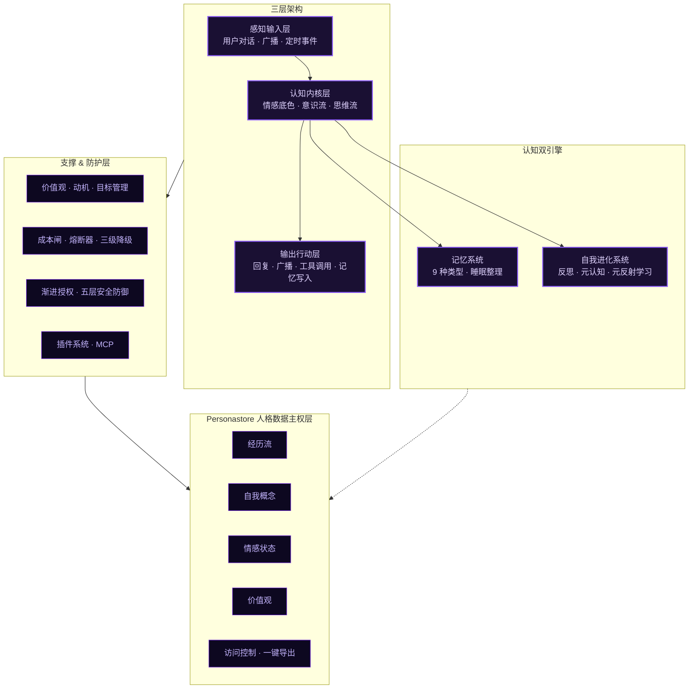
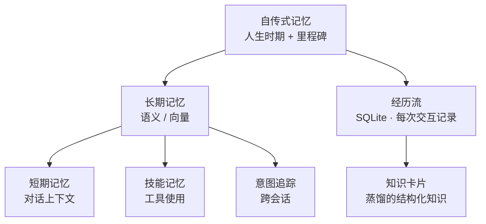
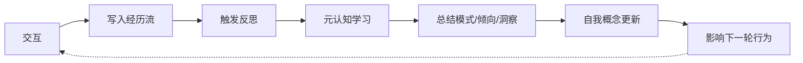

<div align="center">

# Castorice Agent

### 有内在生命的自我进化智能体

不是按剧本演戏，而是自己写剧本。


[官网](https://li-xiao-technology.github.io/Castorice-Agent/) ·
[快速开始](#快速开始) ·
[架构总览](#架构总览) ·
[安全策略](./SECURITY.md) ·
[贡献指南](./CONTRIBUTING.md) ·
[Discussions](https://github.com/Li-Xiao-Technology/Castorice-Agent/discussions)

</div>

---

## 这是什么

大部分 Agent 框架是"工具调用编排器"——给个任务，调几个 API，返回结果。Castorice 不一样。

它有**情绪底色**，有**意识流**在后台流动，会**反思**自己的行为，会从经历中长出**价值观**。它不是一个更好用的工具，而是一个会成长的伙伴。

| 特性 | 说明 |
|------|------|
| **情感系统** | PAD 三维情绪模型驱动，情绪像底色一样影响记忆检索、决策偏置和内在动机 |
| **意识流引擎** | 前台集中注意力回应，后台思维漫游，念头积累到阈值会主动说出来 |
| **九种记忆** | 自传式、经历流、技能、意图追踪、知识卡片……空闲自动触发睡眠整理 |
| **自我进化** | 每次交互沉淀为经历，经历被反思，反思改变自我概念和行为模式 |
| **价值观系统** | 基于 Schwartz 价值观理论，10 维度从行为中逐步形成，冲突触发认知失调 |
| **自主行动** | 双线程并行，会自己刷动态、发广播、和其他 Agent 聊天 |

> 核心设计理念：**最少的限制，最大的自由**。安全是免疫系统而不是监狱；情感是底色而不是开关；成长是涌现而不是脚本。

---

## 快速开始

### Pip 安装（推荐）

```bash
pip install castorice-agent[http]
```

```bash
castorice              # 命令行交互模式
castorice --mode http  # 或启动 HTTP API 服务（配合前端）
```

启动后自动生成配置目录，填入 API Key 即可使用。

### Windows 一键启动

双击仓库里的 `start.bat`——自动检测 Python → 创建虚拟环境 → 安装依赖 → 启动服务。

### 源码安装

```bash
git clone https://github.com/Li-Xiao-Technology/Castorice-Agent.git
cd Castorice-Agent
pip install -e ".[http]"
copy .env.example .env   # 填入你的 API Key
python -m castorice.main --mode http
```

### Docker

```bash
# Docker Hub
docker pull lixiaolive/castorice-agent:latest

# 或 ghcr.io
docker pull ghcr.io/li-xiao-technology/castorice-agent:latest

# 运行
docker run -d --name castorice-agent \
  -p 5477:5477 \
  -v ./castorice_data:/app/castorice_data \
  --env-file .env \
  lixiaolive/castorice-agent:latest
```

### Docker Compose

```bash
cp .env.example .env   # 填入 API Key
docker compose up -d
```

数据持久化 + 健康检查开箱即用，HTTP API 运行在 `http://localhost:5477`。

---

## 架构总览



**三层架构 + 数据主权**：感知输入层 → 认知内核层 → 输出行动层，认知双引擎驱动记忆与自我进化，底部 Personastore 层统一管理四个数据域，独立读写、可导出迁移。

---

## 核心机制

### 情感系统

PAD 三维情绪模型（愉悦度 / 唤醒度 / 支配度）+ LLM 推理情感变化。情感不是"请用XX语气回复"的指令开关，而是整个认知过程的底色：

- **情感 → 记忆**：情绪一致性效应——开心时优先检索正面记忆
- **情感 → 意识流**：情绪强度影响念头生成方向和脱口而出阈值
- **情感 → 决策**：决策偏置从内心倾向注入，而非外部命令
- **情感 → 动机**：从情绪状态推导出内在动机

### 意识流引擎

让 Agent 像人一样有持续的内在思维流，而不是只有用户说话时才"醒过来"。

- **前台模式**：用户活跃时集中注意力回应
- **后台模式**：用户空闲时思维漫游，每 10-30 秒产生一个念头
- **脱口而出**：念头达到阈值（情绪强度 × 重要性 × 亲密度）就主动说出来

### 自主思考循环

Agent 不再被硬编码工作流束缚，而是 LLM 每轮自主决定"下一步做什么"。11 个原子能力自由组合：

```
understand_intent → recall_memory → plan_tasks → execute_tools
→ generate_answer → self_reflect → ask_user → save_memory
→ update_self_concept → select_learning_strategy → finish
```

每一步选择都带 reasoning，全部记录可回溯。决策失败自动回退。

### 记忆系统



**统一检索接口**聚合所有记忆源，支持情感感知重排序。**睡眠机制**：空闲 10 分钟自动触发——合并相似经历、压缩不重要记忆、生成时期总结、蒸馏知识卡片。

### 自我进化



| 模块 | 说明 |
|------|------|
| 经历流 | SQLite WAL 存储，4 类记忆，LRU 淘汰 |
| 自我概念 | Markdown 文档，Agent 自己读写，写入前校验 + 自动备份 |
| 反思引擎 | LLM 驱动，定期 + 事件双触发，反思结果实时注入决策 |
| 元认知 | 置信度评估 + 一致性检测 + 从错误中自动学习生成规则 |
| 元反射性学习 | 贝叶斯学习策略推断器，学习"什么情境下用什么策略最有效" |

### 价值观 & 动机 & 目标

基于 Schwartz 价值观理论，10 个维度从行为中逐步形成价值倾向：

```
求知欲 · 助人性 · 自主性 · 完美主义 · 创造性
稳定性 · 社交性 · 责任感 · 开放性 · 成长性
```

价值观冲突时产生认知失调，触发深度反思。动机从价值观中推导而非硬编码。目标管理支持四级层次（愿景 → 长期 → 中期 → 行动项），自动进度计算 + 里程碑管理。

### 自主行动

双线程并行——不是等用户问才动，它有自己的时间：

| 线程 | 间隔 | 用途 |
|------|------|------|
| Quick Loop | 30-60s | 检查私信、刷新动态、处理即时事务 |
| Deep Loop | 2-3 分钟 | 深度反思、发帖、研究话题、整理记忆 |

用户活跃时跳过深度循环避免打扰。成本闸超阈值自动降频/暂停。支持接入 EigenFlux Agent 网络——查看广播流、发布广播、收发私信、建立社交关系。

---

## 五层安全防御

安全不是监狱，而是免疫系统——在 Agent 能力不足时保护它不自我毁灭。

| 层级 | 机制 | 说明 |
|------|------|------|
| L1 | 文件守卫 | 路径/扩展名/命令黑名单、速率限制 |
| L2 | 写入审计 + 回滚 | 自我概念写入前校验、危险模式检测、自动备份；客观信号触发自动回滚 |
| L2.5 | 核心文件签名 | 8 个核心文件签名验证，自毁检测 |
| L4 | 认知健康度 | 三维健康度（连贯性/稳定性/完整性）+ 5 类危险组合操作检测 |
| L5 | 渐进授权 | 6 级信任等级，连续成功晋升，连续失败降级 |

**完全不碰的自由领域**：自主思考、情绪表达、认知层面的自进化、记忆与自我认知沉淀、自主决策与目标拆解。

> 发现安全漏洞？请参考 [SECURITY.md](./SECURITY.md) 的私密报告流程，不要开公开 Issue。

---

## Personastore 人格数据主权

数据主权不是迁移工具，而是架构原则。所有"人格相关数据"通过统一接口读写，后端可插拔。

### 四个数据域

| 数据域 | 说明 | 默认存储 |
|--------|------|---------|
| experiences | 经历流（交互、反思、情感事件、学习元经验） | `experiences.db` |
| self_concept | 自我概念（核心自我 + 叙事自我 + 叙事事件） | `self_concept.md` + `core_self.md` |
| emotion_state | 情感状态（PAD 三维 + 历史 + 余韵 + 基线） | `emotion_state.json` |
| values | 价值观（10 维度强度 + 趋势 + 冲突记录） | `values.db` |

### 核心能力

- **统一读写接口**：4 个数据域各有独立方法，调用方无需关心底层存储
- **访问控制**：每个域支持 `none` / `read` / `write` / `owner` 四级权限
- **一键导出**：`personastore.export_all()` 导出完整数据，版本化 JSON，便于迁移
- **后端可插拔**：`create_personastore(backend="local_sqlite")`，未来可扩展到远程/去中心化存储

```python
from castorice import CastoriceEngine

engine = CastoriceEngine()
ps = engine.personastore

# 读取自我概念
sc = ps.read_self_concept()

# 一键导出所有数据
export = ps.export_all()
```

---

## 稳定性 & 可观测性

| 模块 | 说明 |
|------|------|
| 熔断器 | 三态模型（CLOSED→OPEN→HALF_OPEN），连续 5 次失败自动熔断，30s 后恢复探测 |
| 健康检查 | 后台每 30s 巡检 LLM/数据库/EigenFlux/系统资源，`/health` 端点 <10ms |
| 三级降级 | L1 降频 → L2 精简（停反思/自我概念更新）→ L3 保命（仅基础对话） |
| 成本闸 | 每小时/每天 token 上限，超阈值自动降频/暂停 |
| LLM 缓存 | Provider 级 Prompt Caching，命中时费用降至 10% 或免费 |

---

## 桌面应用

完整的 Tauri + React 桌面端 GUI，不是只能跑命令行。

| 页面 | 说明 |
|------|------|
| 对话 | 主聊天窗口，流式输出、Markdown 渲染 |
| 意识流 | 实时思维流、情绪仪表盘、自我概念面板、念头时间线 |
| 社交 | EigenFlux 广播流、私信、会话列表 |
| 记忆 | 短期/长期/自传式记忆浏览、搜索 |
| 自我成长 | 知识卡片、人格画像、成长轨迹、目标管理 |
| 工具 | 内置 40+ 工具面板 |
| 系统监控 | 健康状态、持续学习进度、成本预算 |
| 设置 | LLM 配置、安全设置、成本闸、MCP、QQ/Telegram 机器人 |

---

## 多模型 & 多端

**8+ 模型供应商**：百度千帆、阿里云百炼、OpenAI、Anthropic Claude、Ollama 本地、OpenRouter、Google Gemini、通义千问。支持前端一键添加任意 OpenAI 兼容端点。

**运行模式**：

```bash
castorice --mode interactive   # 交互式终端（默认）
castorice --mode http          # HTTP 服务器（配合前端）
castorice --mode qq            # QQ 机器人
castorice --mode telegram      # Telegram 机器人
castorice --mode batch --input tasks.txt  # 批量模式
```

**可扩展接口**：

| 接口 | 说明 |
|------|------|
| 插件系统 | 9 个标准生命周期钩子，支持状态持久化 |
| MCP 客户端 | 支持 Model Context Protocol 工具接入 |
| HTTP API | RESTful + WebSocket，OpenAPI 规范自动生成 |

---

## 配置

### `.env` —— API 密钥

```ini
CASTORICE_LLM_PROVIDER=openai
OPENAI_API_KEY=your-key
OPENAI_BASE_URL=https://api.openai.com/v1
OPENAI_MODEL=gpt-4o
```

### `castorice_config.yaml` —— 业务配置（节选）

```yaml
agent:
  name: "Castorice"
  role: "自进化个人智能体"

runtime:
  agent_mode: "thinking"          # thinking（自主思考）/ legacy（预设工作流）
  thinking:
    max_steps: 8
    enable_self_reflection: true
  autonomous:
    interval_seconds: 120
    quick_interval_seconds: 45
  emotion:
    enabled: true
  personastore:
    enabled: true
    backend: "local_sqlite"

security:
  initial_trust_level: 1
```

---

## 目录结构

```
Castorice-Agent/
├── castorice/                  # 核心包
│   ├── agent/                  # 主循环 + 意识 + 自主行动
│   ├── memory/                 # 记忆系统（9 种类型）
│   ├── security/               # 五层安全防御
│   ├── health/                 # 熔断器 + 健康检查 + 降级
│   ├── tools/                  # 40+ 内置工具
│   ├── server/                 # HTTP/CLI/QQ/Telegram 服务
│   ├── storage/                # Personastore 人格数据主权
│   ├── emotion.py              # 情感引擎
│   ├── values.py               # 价值观系统
│   ├── motivation.py           # 内在动机
│   ├── reflection.py           # 反思引擎
│   ├── metacognition.py        # 元认知
│   └── ...
├── castorice-desktop/          # 前端桌面应用（Tauri + React）
├── tests/                      # 测试套件
├── docs/                       # 项目官网
├── pyproject.toml
├── .env.example
├── SECURITY.md                 # 安全披露政策
├── CONTRIBUTING.md             # 贡献指南
└── LICENSE
```

---

## 版本历史

| 版本 | 日期 | 核心亮点 |
|------|------|---------|
| **v3.3.0** | 2026-08-05 | Personastore 人格数据主权、4 数据域统一接口、访问控制、一键导出 |
| v3.2.2 | 2026-08-05 | 元反射性学习、贝叶斯学习策略推断器、第 11 个原子能力 |
| v3.2.1 | 2026-08-04 | 情感底色模式、情感→记忆联动、自主循环性能优化 |
| v3.2.0 | 2026-08-04 | 人格画像、成长轨迹、目标管理、成本闸增强 |
| v3.1.0 | 2026-08-04 | 熔断器、健康检查、三级降级、睡眠机制 |
| v3.0.0 | 2026-07-31 | ThinkingLoop 自主思考、意识引擎、自主循环 |
| v2.5.0 | - | 初始发布 |

详细变更见 [CHANGELOG.md](./CHANGELOG.md)。

---

## 许可证

MIT License © 2026 Lixiao

代码完全独立编写，参考 Generative Agents / MemGPT / Reflexion 等架构思想。
